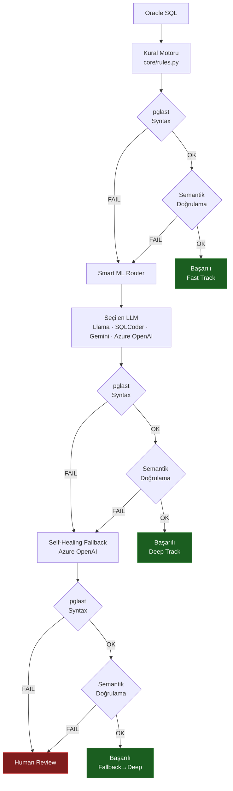
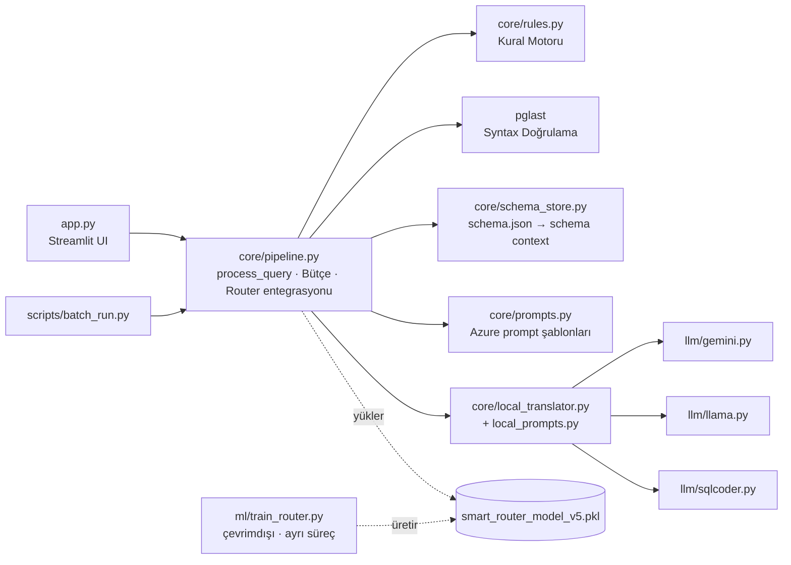

# Oracle → PostgreSQL AI Migration Platform

> Oracle SQL sorgularını PostgreSQL'e çeviren hibrit migration platformu: deterministik kural motoru + ML tabanlı yönlendirici + çoklu LLM (Azure OpenAI, Google Gemini, yerel Llama / SQLCoder), gerçek bir PostgreSQL parser'ı ile doğrulama ve self-healing fallback.


---

## İçindekiler

- [Öne Çıkan Özellikler](#öne-çıkan-özellikler)
- [Hızlı Başlangıç](#hızlı-başlangıç)
- [Nasıl Çalışır?](#nasıl-çalışır)
- [Mimari](#mimari)
- [Streamlit Arayüzü](#streamlit-arayüzü)
- [Örnek Çeviri](#örnek-çeviri)
- [Proje Yapısı](#proje-yapısı)
- [Modül Durumu](#modül-durumu)
- [Yapılandırma](#yapılandırma)
- [ML Router](#ml-router)
- [CLI Araçları](#cli-araçları)
- [Performans ve Sonuçlar](#performans-ve-sonuçlar)
- [Bilinen Sınırlamalar](#bilinen-sınırlamalar)

---

## Öne Çıkan Özellikler

| Özellik | Açıklama |
|---|---|
| **Maliyetsiz ilk katman** | Deterministik regex kural motoru sorguların bir bölümünü milisaniyeler içinde, sıfır LLM maliyetiyle çözer. |
| **Gerçek parser doğrulaması** | Her çıktı `pglast` ile gerçek bir PostgreSQL parser'ından geçirilir; "çalışıyor gibi görünen" çıktı kabul edilmez. |
| **MyBatis/iBatis uyumu** | XML etiketleri (`<if>`, `<isNotNull>`) ve bind parametreleri (`:param`, `#{param}`, `?`) parse öncesi gölge değerlerle değiştirilerek doğrulanır. |
| **ML tabanlı yönlendirme** | Eğitilmiş sınıflandırıcı, her sorgu için en uygun/en ucuz LLM'i seçer. Model yoksa regex tabanlı yönlendirmeye düşer. |
| **Semantik doğrulama** | Oracle ↔ PostgreSQL mantıksal eşdeğerliği LLM ile kontrol edilir; arayüzden kapatılabilir. |
| **Self-healing fallback** | Doğrulamadan geçemeyen çeviri için hatayı açıklayan tek seferlik düzeltme isteği gönderilir. |
| **Bütçe kontrolü** | Azure OpenAI çağrıları $ cinsinden limite karşı ölçülür; limit aşılırsa çağrılar durdurulur. |
| **Human Review** | Otomatik olarak çözülemeyen sorgular sessizce kabul edilmez, insan incelemesine işaretlenir. |

---

## Hızlı Başlangıç

### Gereksinimler

- **Python 3.11** (proje bu sürümle geliştirilip test edilmiştir)
- **Azure CLI** — kimlik doğrulama `AzureCliCredential` ile yapılır, statik API anahtarı kullanılmaz
- **[LM Studio](https://lmstudio.ai/)** — yerel Llama / SQLCoder modelleri için, `http://localhost:1234/v1` adresinde çalışır durumda *(yalnızca yerel modeller kullanılacaksa gereklidir)*

### Kurulum

```bash
git clone <repo-url>
cd <proje-dizini>

python -m venv .venv
source .venv/bin/activate        # Windows: .venv\Scripts\activate

pip install -r requirements.txt
```

### Yapılandırma

```bash
az login                          # Azure OpenAI erişimi için zorunlu

cp .env.example .env              # Windows: copy .env.example .env
```

Ardından `.env` içindeki değerleri kendi bilgilerinizle doldurun. `.env.example` repoya dahildir ve yalnızca kodun gerçekten okuduğu üç değişkeni içerir; alan açıklamaları için bkz. [Yapılandırma](#yapılandırma).

### Çalıştırma

```bash
streamlit run app.py
```

Uygulama varsayılan olarak `http://localhost:8501` adresinde açılır. Proje özel bir port veya `.streamlit/config.toml` tanımlamaz, ek argüman gerekmez.

---

## Nasıl Çalışır?

Bir Oracle SQL sorgusu aşağıdaki aşamalardan geçer:

**1. Kural Motoru** — `core/rules.py`
Regex tabanlı deterministik dönüşümler: `NVL`, `DECODE`, `ROWNUM`, `SYSDATE`, `(+)` outer join, `CONNECT BY`, DDL farklılıkları vb. Milisaniyeler içinde çalışır, LLM maliyeti oluşturmaz.

**2. Sözdizimi Doğrulama** — `pglast`
Üretilen PostgreSQL çıktısı gerçek bir PostgreSQL parser'ından geçirilir. MyBatis/iBatis XML etiketleri ve bind parametreleri parse öncesinde geçici "gölge" değerlerle değiştirilir, böylece parser bozulmadan doğrulama yapılabilir.

**3. Semantik Doğrulama** — Azure OpenAI
Oracle ve PostgreSQL sorgularının mantıksal olarak eşdeğer olup olmadığı bir LLM'e sorulur: tip uyumu, JOIN yönü, tarih aritmetiği vb. Bu adım arayüzden açılıp kapatılabilir.

**4. Smart ML Router**
Kural motorunun çözemediği ya da semantik doğrulamadan geçemeyen sorgular, eğitilmiş bir sınıflandırma modeli (`smart_router_model_v5.pkl`) ile analiz edilerek en uygun LLM'e yönlendirilir. Model yoksa sistem otomatik olarak regex tabanlı yönlendirme mantığına düşer.

**5. Self-Healing Fallback**
LLM çevirisi doğrulamadan geçemezse, hatayı açıklayan tek seferlik bir düzeltme isteği Azure OpenAI'a gönderilir. Bu da başarısız olursa sorgu **Human Review** durumuna işaretlenir.

**6. Bütçe Kontrolü**
Azure OpenAI çağrıları $ cinsinden bir bütçe limitine karşı ölçülür; limit aşılırsa yeni çağrılar durdurulur.

---

## Mimari

### Çeviri Pipeline'ı



**Özet kural:** her çeviri denemesi *syntax → semantik* sırasıyla doğrulanır. Doğrulama başarısızsa bir sonraki katmana (Router → Fallback) devredilir; son katman da başarısız olursa sorgu Human Review'a düşer.

### Katman Mimarisi



> `core/pipeline.py` yalnızca iş mantığını içerir; `app.py` bu modülden `process_query()` fonksiyonunu çağıran salt UI katmanıdır. Aynı pipeline `scripts/batch_run.py` üzerinden toplu olarak da çalıştırılabilir. `ml/train_router.py` çalışma anında pipeline tarafından çağrılmaz — yalnızca `smart_router_model_v5.pkl` dosyasını üreten, elle/çevrimdışı çalıştırılan ayrı bir eğitim script'idir.

---

## Streamlit Arayüzü

<!-- TODO: Ekran görüntüleri eklenecek — docs/screenshots/ altına (Çeviri sekmesi + sonuç kartı) -->

### "Çeviri" Sekmesi

- **Sol panel:** Oracle SQL girişi + `Çevir` / `Temizle` butonları
- **Sağ panel:** Üretilen PostgreSQL çıktısı + `.sql` indirme butonu
- **Canlı log paneli:** Pipeline'ın hangi aşamada olduğunu (kural motoru, semantik doğrulama, router kararı, fallback) anlık gösterir
- **Sonuç kartı:**
  - Durum rozeti: `✔ Başarılı` / `✗ Human Review`
  - Track rozeti: `Fast Track` · `Deep Track` · `Fast→Deep` · `Fallback→Deep`
  - Kaynak rozeti: sorguyu çözen motor (`rules`, `llama`, `sqlcoder`, `gemini`, `openai` veya fallback zincirleri)
  - Semantik doğrulama sonucu ve GPT fallback kullanılıp kullanılmadığı
  - Çeviri / semantik / toplam maliyet ($) ve işlem süresi
  - Oracle ve PostgreSQL sorgularının yan yana kod görünümü
  - Varsa syntax veya semantik hata mesajları

### "Geçmiş" Sekmesi

- Oturum içi toplam çeviri sayısı, başarılı / human-review sayısı ve toplam maliyet özeti
- Geçmiş çevirilerin listesi: zaman damgası, durum, sorgu önizlemesi, kaynak, maliyet
- Geçmişi temizleme butonu

### Kenar Çubuğu

| Bölüm | İçerik |
|---|---|
| **Bütçe** | $ limiti belirleme, harcanan/kalan tutar ilerleme çubuğu, bütçeyi sıfırlama |
| **Ayarlar** | Semantik doğrulama aç/kapa anahtarı — kapalıyken yalnızca syntax kontrolü yapılır, LLM maliyeti oluşmaz |
| **Bağlantı Durumu** | Azure OpenAI bağlantısı ve ML Router modelinin yüklü olup olmadığını gösteren rozetler |
| **Örnek Sorgular** | NVL/ROWNUM, DECODE/SYSDATE, Oracle Outer Join, CONNECT BY, PIVOT ve Window Function örneklerini tek tıkla dolduran butonlar |

---

## Örnek Çeviri

Aşağıdaki örnek gerçek bir pipeline çalıştırmasından alınmıştır (`core/pipeline.py` → `process_query()`) ve uygulamanın kendi "Örnek Sorgular" listesindeki geçerli PIVOT örneğiyle birebir aynıdır — Streamlit arayüzünde sidebar'dan tek tıkla tekrar üretilebilir. Sorgu `PIVOT` içerdiği için kural motoru bunu deterministik olarak çeviremez; `check_unsupported()` doğrudan `LLM_NEEDED` döndürerek Smart Router'a yönlendirir, Smart Router da sorguyu Gemini'ye atamıştır.

**Girdi — Oracle**

```sql
SELECT * FROM (
  SELECT department_id, job_id, salary
  FROM employees
)
PIVOT (
  AVG(salary) FOR job_id IN ('IT_PROG','SA_REP')
);
```

**Çıktı — PostgreSQL**

```sql
WITH pivoted_data AS (
  SELECT department_id, job_id, salary
  FROM employees
)
SELECT
  department_id,
  AVG(CASE WHEN job_id = 'IT_PROG' THEN salary END) AS IT_PROG,
  AVG(CASE WHEN job_id = 'SA_REP' THEN salary END) AS SA_REP
FROM
  pivoted_data
GROUP BY
  department_id;
```

| Track | Kaynak | Syntax | Semantik | Çeviri Maliyeti (Gemini) | Semantik Maliyet (Azure) | Süre |
|---|---|---|---|---|---|---|
| `deep_direct` | `gemini` | ✔ OK | ✔ OK | $0.00000 | $0.00070 | 24.2s |

> **Maliyet takibi hakkında:** Bütçe sistemi yalnızca **Azure OpenAI** çağrılarını $ olarak sayar. Bu örnekte çeviriyi yapan Gemini'nin kendi API maliyeti bütçeye hiç yansımaz (`$0.00000` "izlenmiyor" demektir, "ücretsiz" demek değildir — Gemini tarafında ayrıca kendi kotanız/faturalandırmanız işler). Tablodaki tek $ değeri, çeviri sonrası çalışan Azure semantik doğrulama adımına aittir. Detay için bkz. [Bilinen Sınırlamalar](#bilinen-sınırlamalar).

---

## Proje Yapısı

```text
├── app.py                        # Streamlit arayüzü (UI katmanı, giriş noktası)
├── schema.json                   # Örnek veritabanı şeması (tablo/sütun → PostgreSQL tip eşlemesi)
├── smart_router_model_v5.pkl     # Eğitilmiş Smart Router modeli (git'e dahil değil)
├── sondataset.xlsx               # ML Router eğitim veri seti (git'e dahil değil)
├── requirements.txt              # Python bağımlılıkları
├── .env.example                  # .env şablonu (repoya dahil)
├── .env                          # Gerçek uç nokta / anahtar bilgileri (git'e dahil değil)
├── .gitignore
│
├── core/                         # Canlı pipeline'ın çekirdek iş mantığı
│   ├── pipeline.py               # process_query(), bütçe, Azure client, ML Router entegrasyonu
│   ├── rules.py                  # Deterministik Oracle → PostgreSQL kural motoru
│   ├── prompts.py                # Azure OpenAI prompt şablonları (çeviri / semantik / self-healing)
│   ├── schema_store.py           # schema.json'ı okuyup sorguya özel "schema context" üretir
│   ├── local_translator.py       # Yerel/hosted LLM çağrı sarmalayıcısı (Llama, SQLCoder, Gemini)
│   └── local_prompts.py          # local_translator.py'nin kullandığı prompt şablonu
│
├── llm/                          # LLM sağlayıcı adaptörleri
│   ├── gemini.py                 # Google Gemini (langchain-google-genai) LLM fabrikası
│   ├── llama.py                  # Yerel Llama-3.1 (LM Studio, OpenAI uyumlu API) LLM fabrikası
│   └── sqlcoder.py               # Yerel SQLCoder-7B (LM Studio) LLM fabrikası
│
├── ml/
│   └── train_router.py           # Sınıflandırma modelini eğitir → smart_router_model_v5.pkl
│
├── scripts/                      # Bağımsız CLI araçları / toplu çalıştırıcılar
│   ├── schema_extractor.py       # schema.json üretir (canlı Oracle DB veya DDL dosyalarından)
│   ├── batch_run.py              # core/pipeline.py'yi Excel/CSV veri seti üzerinde toplu çalıştırır
│   └── legacy_pipeline.py        # Eski/bağımsız toplu CLI pipeline'ı (kural motoru + yerel LLM'ler)
│
├── reports/                      # Toplu çalıştırma çıktıları (çalışma anında üretilir)
│   └── pipeline_full_analysis.csv
│
└── utils/                        # Pipeline'a şu an bağlı olmayan yardımcı modüller
    ├── sql_splitter.py           # Çok ifadeli SQL script'lerini tek tek statement'lara ayırır
    └── query_storage.py          # Çevrilen SQL parçalarını birleştirip dosyaya kaydeder
```

---

## Modül Durumu

Hangi modülün canlı pipeline'ın parçası olduğu sık karıştırıldığı için netleştirilmiştir:

| Modül | Durum | Not |
|---|---|---|
| `app.py` + `core/pipeline.py` | 🟢 **Aktif — canlı pipeline** | Bütçe kontrolü, semantik doğrulama ve self-healing fallback dahil gerçek zamanlı akış |
| `core/local_translator.py`, `core/local_prompts.py` | 🟢 **Aktif** | Smart Router bir sorguyu Llama/SQLCoder/Gemini'ye yönlendirdiğinde devreye girer — `legacy_pipeline.py`'ye özgü **değildir** |
| `scripts/batch_run.py` | 🟢 **Aktif** | Canlı pipeline'ı toplu çalıştırır |
| `scripts/legacy_pipeline.py` | 🟡 **Alternatif** | Azure OpenAI'a bağımlı olmayan, yalnızca kural motoru + yerel LLM'lerle çalışan basit batch CLI; ayrı kullanım senaryosu için tutulmaktadır |
| `utils/sql_splitter.py`, `utils/query_storage.py` | ⚪ **Pasif** | Şu anda hiçbir pipeline tarafından çağrılmaz; ileride kullanılmak üzere tutulmaktadır |

---

## Yapılandırma

Proje kök dizininde bir `.env` dosyası aşağıdaki değişkenleri içermelidir:

| Değişken | Zorunlu | Açıklama |
|---|---|---|
| `AZURE_OPENAI_ENDPOINT` | ✅ | Azure OpenAI kaynağının uç nokta URL'i |
| `AZURE_DEPLOYMENT_NAME` | ✅ | Azure OpenAI deployment adı (hem çeviri hem semantik doğrulama için kullanılır) |
| `GEMINI_API_KEY` | ⬜ | Google Gemini API anahtarı (Smart Router `gemini` etiketini seçtiğinde kullanılır) |

> Azure OpenAI erişimi statik API anahtarı ile değil, `AzureCliCredential` üzerinden yapılır — makinede `az login` ile giriş yapılmış olması gerekir.
>
> `.env` dosyası `.gitignore` içinde olduğu için repoya dahil edilmez; şablonu `.env.example` dosyasındadır. Teslim sırasında gerçek `.env` içeriği ayrıca paylaşılmalıdır.

### Fiyatlandırma ve bütçe

Token maliyeti `core/pipeline.py` içinde **kodda sabittir** (`PRICE_INPUT = 0.15`, `PRICE_OUTPUT = 0.60`, $/1M token) ve yalnızca Azure OpenAI çağrılarını kapsar.

`.env` dosyasında görülebilecek `FIYAT_PROMPT_PER_MILLION`, `FIYAT_COMPLETION_PER_MILLION` ve `MAKSIMUM_BUTCE_USD` değişkenleri **kod tarafından hiçbir yerde okunmaz**; geçmişten kalma, şu an etkisiz değişkenlerdir ve `.env.example` içinde yer almazlar. Bütçe limiti kod içinde değil, Streamlit arayüzünün "Bütçe" panelinden ($ cinsinden, varsayılan 0.80) belirlenir.

### LM Studio (yerel modeller)

`llm/llama.py` ve `llm/sqlcoder.py` içindeki LM Studio bağlantı bilgileri env değişkeni değil, **kodda sabittir**:

| Model | LM Studio'da yüklenmesi gereken tam model adı | Endpoint |
|---|---|---|
| Llama | `meta-llama-3.1-8b-instruct` | `http://localhost:1234/v1` |
| SQLCoder | `sqlcoder-7b-2` | `http://localhost:1234/v1` |

`api_key="lm-studio"` alanı gerçek bir anahtar değildir; LM Studio'nun OpenAI-uyumlu API'si anahtarı doğrulamaz, yalnızca alanın dolu olmasını bekler.

### schema.json

`schema.json`, LLM prompt'larına doğru tablo/sütun tiplerini (ve olası tip uyumsuzluğu uyarılarını) eklemek için kullanılır ve `scripts/schema_extractor.py` ile üretilebilir. Format — `{SCHEMA: {TABLE: {"columns": {COLUMN: {"pg_type": ...}}}}}`:

```json
{
  "KRD": {
    "CUSTOMER_ACCOUNT": {
      "columns": {
        "BRANCH_CODE": { "pg_type": "VARCHAR(10)" },
        "ACCOUNT_NUMBER": { "pg_type": "NUMERIC" },
        "CUSTOMER_ID": { "pg_type": "NUMERIC" },
        "OPEN_DATE": { "pg_type": "DATE" },
        "CURRENCY_CODE": { "pg_type": "VARCHAR(3)" }
      }
    }
  }
}
```

---

## ML Router

`ml/train_router.py`, etiketlenmiş bir sorgu veri setinden (`sondataset.xlsx`) **41 sayısal özellik** çıkarır — SQL uzunluğu, JOIN/subquery sayısı, hangi Oracle'a özgü fonksiyonların geçtiği, pattern eşleşme sayaçları vb. Ardından birden fazla sınıflandırma algoritmasını (RandomForest, GradientBoosting, DecisionTree ve mevcutsa XGBoost / LightGBM / CatBoost) çapraz doğrulama ile karşılaştırır ve en iyi F1 skoruna sahip modeli `smart_router_model_v5.pkl` olarak kaydeder.

Yayınlanan `smart_router_model_v5.pkl` dosyasına gömülü metadata'dan okunan eğitim sonucu:

| | |
|---|---|
| Seçilen model | **XGBoost** |
| Çapraz doğrulama F1 skoru | **0.971** |
| Etiketlenmiş sorgu sayısı | **210** (`training_report_v5.csv`) |
| Etiket dağılımı | Rule 60 · SQLCoder 62 · Gemini 53 · Azure OpenAI 22 · Llama 13 |

> **Metodolojik not:** Azınlık sınıfları (Llama, Azure OpenAI) çapraz doğrulama **öncesinde** oversampling ile büyütülmektedir. Bu, aynı satırların hem eğitim hem doğrulama katmanına düşmesine yol açtığı için 0.971 F1 skoru iyimser taraflıdır ve modelin görülmemiş sorgular üzerindeki gerçek performansını temsil etmeyebilir. Skorun taraflılıktan arınması için oversampling'in CV döngüsünün *içine* alınması gerekir (ör. `imblearn.pipeline.Pipeline`). Ayrıca 210 örnek, 5 sınıf ve 41 özellik için görece küçük bir veri setidir.
>
> Modelin `note` alanındaki "273 real-labeled" ifadesi oversample sonrası büyüklüktür; tekil etiketlenmiş sorgu sayısı 210'dur.

### Sınıf Etiketleri

| Etiket | Hedef | Anlamı |
|:---:|---|---|
| `0` | Rule Engine | Kural motoru yeterli |
| `1` | Llama | Yerel model (LM Studio) |
| `2` | SQLCoder | Yerel model (LM Studio) |
| `3` | Gemini | Hosted model |
| `4` | Azure OpenAI | Karmaşık / PL/SQL içeren sorgular |

### Modelin Eğitilmesi

```bash
python ml/train_router.py
```

CLI argümanı almaz — veri seti yolu (`DATASET_FILE`), rapor dizini (`REPORTS_DIR`) ve model çıktı yolu (`MODEL_OUTPUT`) dosyanın en üstündeki sabitler olarak tanımlıdır, gerekirse elle düzenlenir.

> Model dosyası bulunamazsa sistem hata vermeden regex tabanlı pattern-matching mantığına düşer; Smart Router her koşulda çalışmaya devam eder.

---

## CLI Araçları

### `scripts/schema_extractor.py`

Canlı bir Oracle veritabanına bağlanarak ya da DDL dosyalarını parse ederek `schema.json` üretir. CLI argümanı alan tek araç budur (`argparse`).

```bash
# Canlı Oracle DB'den çek (pip install oracledb gerekir)
python scripts/schema_extractor.py --mode oracle \
  --dsn "user/pass@host:1521/SERVICENAME" --output schema.json

# DDL dosyalarından (bir dizin veya tek dosya) parse et
python scripts/schema_extractor.py --mode ddl --ddl-path ./ddl/ --output schema.json
```

| Argüman | Zorunlu | Açıklama |
|---|---|---|
| `--mode` | ✅ | `oracle` veya `ddl` |
| `--dsn` | `oracle` modunda | Oracle bağlantı dizesi |
| `--schemas` | ⬜ | Virgülle ayrılmış şema adları (boşsa hepsi) |
| `--ddl-path` | `ddl` modunda | DDL dosyası veya dizini (varsayılan `.`) |
| `--default-schema` | ⬜ | DDL modunda şema adı yoksa kullanılacak varsayılan (varsayılan `PUBLIC`) |
| `--output` | ⬜ | Çıktı dosyası (varsayılan `schema.json`) |

### `scripts/batch_run.py`

Canlı pipeline'ı (`core/pipeline.py`) bir Excel/CSV veri seti üzerinde uçtan uca çalıştırır; sonuçları (durum, maliyet, süre, kaynak LLM vb.) bir Excel dosyasına yazar ve her 50 sorguda bir ara yedek alır. **CLI argümanı almaz** — veri seti yolu, çıktı dosyası ve SQL sütunu adı, dosyanın en üstündeki `INPUT_FILE` / `OUTPUT_FILE` / `SQL_COLUMN` sabitleri elle düzenlenerek değiştirilir.

```bash
python scripts/batch_run.py
```

### `scripts/legacy_pipeline.py`

Yalnızca kural motoru + yerel LLM'lerle çalışan, Azure OpenAI'a bağımlı olmayan alternatif toplu çalıştırma script'i. Sonuçları `reports/pipeline_full_analysis.csv` dosyasına yazar. **CLI argümanı almaz** — veri seti yolu (`dataset_path`) fonksiyon içinde sabit kodludur.

```bash
python scripts/legacy_pipeline.py
```

---

## Performans ve Sonuçlar

> **Kapsam:** Aşağıdaki toplu çalıştırma sonuçları `scripts/legacy_pipeline.py`'ye aittir (kural motoru + yerel LLM'ler; semantik doğrulama ve Azure fallback **devre dışı**). Canlı pipeline'ın (`app.py` / `scripts/batch_run.py`) aynı veri seti üzerindeki sonuçları henüz ölçülmemiştir; canlı ölçüm için `scripts/batch_run.py` içindeki `INPUT_FILE` sabiti geçerli bir veri setine ayarlanarak script çalıştırılmalı ve bu tablo güncellenmelidir.

### `scripts/legacy_pipeline.py` — son toplu çalıştırma (627 sorgu)

| Metrik | Değer |
|---|---|
| Test edilen sorgu sayısı | 627 |
| Başarılı | 540 (%86.1) |
| Başarısız | 87 (%13.9) |
| — Kural motoruyla çözülen | 501 (%79.9) |
| — Llama ile çözülen | 20 |
| — SQLCoder ile çözülen | 14 |
| — Gemini ile çözülen | 5 |
| Sorgu başına ortalama süre | 4.22s |

*Kaynak: `reports/pipeline_full_analysis.csv`*

### ML Router eğitim sonucu

| Metrik | Değer |
|---|---|
| Seçilen model | XGBoost |
| Çapraz doğrulama F1 | 0.971 (bkz. [metodolojik not](#ml-router)) |
| Eğitim veri seti boyutu | 210 etiketlenmiş sorgu |

### Canlı pipeline — tekil çalıştırma

[Örnek Çeviri](#örnek-çeviri) bölümündeki tek `process_query()` çağrısı: `deep_direct` track, `gemini` kaynak, syntax + semantik OK, 24.2s; bütçeye yansıyan tek maliyet Azure semantik doğrulamasına ait $0.00070 (Gemini çevirisinin kendi maliyeti izlenmiyor). Tek bir örnek genel performans göstergesi değildir; yalnızca pipeline'ın uçtan uca çalıştığını gösterir.

---

## Bilinen Sınırlamalar

- Kural motoru, `ROWNUM > N` / `ROWNUM >= N` gibi subquery gerektiren kalıpları veya birden fazla `(+)` içeren outer join'leri deterministik olarak çeviremez; bu durumlarda otomatik olarak Smart Router'a yönlendirilir.
- Semantik doğrulama kapatıldığında yalnızca sözdizimi kontrolü yapılır; mantıksal doğruluk garanti edilmez.
- Yerel LLM'ler (Llama, SQLCoder) LM Studio üzerinden çalıştığı için, bu servisler ayağa kaldırılmadan Smart Router bu modelleri seçtiğinde sistem otomatik olarak Azure OpenAI'a fallback yapar.
- Çeviri sonuçları hedef veritabanında **çalıştırılarak** doğrulanmaz; doğrulama parser (syntax) ve LLM (semantik) düzeyindedir.
- Sözdizimi doğrulaması yalnızca üretilen PostgreSQL çıktısına uygulanır; girdi olarak verilen Oracle sorgusunun geçerliliği ayrıca denetlenmez.
- Bütçe sistemi ($ takibi, limit kontrolü) yalnızca **Azure OpenAI** çağrılarını ölçer. Smart Router bir sorguyu Gemini'ye veya yerel bir modele yönlendirdiğinde, o çağrının kendi maliyeti arayüzdeki bütçeye yansımaz.
